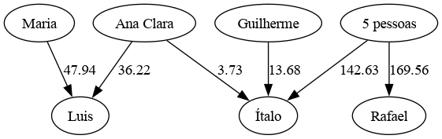

# Rateio

`rateio` é uma ferramenta de linha de comando (CLI) para dividir contas de forma justa e eficiente.

Ela calcula quanto cada pessoa deve pagar ou receber após uma série de gastos compartilhados, 
otimizando o número de transações necessárias para acertar as contas.
Ideal para jantares, viagens, festas ou qualquer situação em que várias pessoas contribuam com valores diferentes.

## Instalação

Certifique-se de ter o [Cargo](https://www.rust-lang.org/tools/install) instalado e então execute:

```bash
cargo install rateio
```

## Como Usar

### Uso básico

```bash
rateio Rafael=150.00 Maria=80.50 Italo=45.00
```
Este comando divide o total de R$ 275,50 igualmente entre as 3 pessoas que pagaram, mostrando quem deve pagar ou receber.

#### Incluindo Pessoas que Não Pagaram
Use a opção `-p` ou `--pessoas` quando houver pessoas que devem participar da divisão mas não fizeram nenhum pagamento:
```bash
rateio -p 5 Rafael=150.00 Maria=80.50
```
Neste exemplo, R$ 230,50 serão divididos entre 5 pessoas (R$ 46,10 cada).

### Exportar como Grafo

Visualize as transações como um grafo usando Graphviz:
```bash
rateio --graphviz Italo=100 "Ana Clara"=50 -p 3 | dot -Tpng > grafo.png
```

## Exemplos Práticos
### Exemplo 1

Três amigos jantaram. Rafael pagou a comida (R$ 120), Maria pagou as bebidas (R$ 45), e Gabriel não pagou nada:
```bash
rateio rafael=120 maria=45 -p 3
```
#### Resultado:
```
Valor total da conta: 165.00
    55.00 para cada

maria:
    total a pagar: 10.00
    total a receber: 0.00

    pagar: 10.00 -> rafael

rafael:
    total a pagar: 0.00
    total a receber: 65.00

Cada uma das 1 pessoas que restaram:
    total a pagar: 55.00
    total a receber: 0.00

    pagar: 55.00 -> rafael
```

### Exemplo 2
Imagine uma festa onde várias pessoas compraram bebidas, comida e decoração.
Os gastos serão divididos igualmente entre todos os convidados, mas se cada pessoa 
que não pagou tiver que reembolsar cada organizador separadamente, seriam dezenas de transferências.
Com o `rateio`, os pagamentos ficam muito mais simples!


```bash
rateio Ítalo=222.48 Maria=14.5 "Ana Clara"=22.48 Luis=146.6 Guilherme=48.76 Rafael=232 -p 11
```

#### Resultado
```
Valor total da conta: 686.82
    62.43 para cada

Ana Clara:
    total a pagar: 39.95
    total a receber: 0.00

    pagar: 36.22 -> Luis
    pagar: 3.73 -> Ítalo

Guilherme:
    total a pagar: 13.68
    total a receber: 0.00

    pagar: 13.68 -> Ítalo

Luis:
    total a pagar: 0.00
    total a receber: 84.16

Maria:
    total a pagar: 47.94
    total a receber: 0.00

    pagar: 47.94 -> Luis

Rafael:
    total a pagar: 0.00
    total a receber: 169.56

Ítalo:
    total a pagar: 0.00
    total a receber: 160.04

Cada uma das 5 pessoas que restaram:
    total a pagar: 62.43
    total a receber: 0.00

    pagar: 33.91 -> Rafael
    pagar: 28.52 -> Ítalo
```
#### Grafo Resultante


## Opções

- `-p, --pessoas <NÚMERO>`: Define o número total de pessoas para a divisão. Se não for especificado, a conta será dividida apenas entre aqueles que realizaram pagamentos.
- `--graphviz`: Exporta o resultado no formato Graphviz DOT em vez do relatório de texto.
- `-h, --help`: Mostra a mensagem de ajuda.
- `-V, --version`: Mostra a versão do programa.
